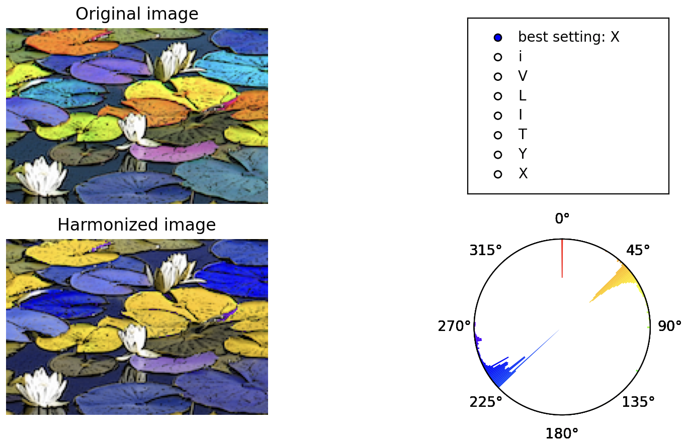
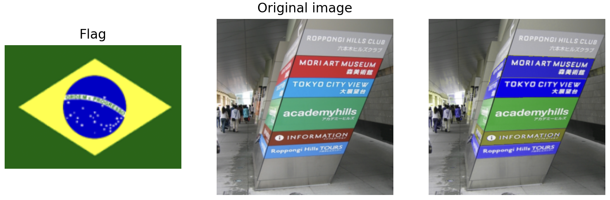

## ICG final project

In this project, we implement color harmonization algorithm. See more details in our report.

### create envrionment
```
conda create --name icg python=3.10
conda activate icg
```
### install requirement
```
pip install -r requirement.txt
```
### Reproduce our main result
```
python3 color_harmonization.py --img_dir <your image path>
```
expected result:



adjustment of output image:
* switch template: just click your preferred template in the menu
* rotate the color wheel:
    * `↑` on keyboard: rotate clockwise by 1 degree
    * `↓` on keyboard: rotate counterclockwise by 1 degree
    * `←` on keyboard: rotate counterclockwise by 10 degrees
    * `→` on keyboard: rotate clockwise by 10 degrees

You can change the template 
### Reproduce hard constaint on flag color
```
python3 flag_constraint.py --source_img <flag image path> --target_img <image for harmonization>
```
expected result:



### Citation
```
@article{10.1145/1141911.1141933,
author = {Cohen-Or, Daniel and Sorkine, Olga and Gal, Ran and Leyvand, Tommer and Xu, Ying-Qing},
title = {Color Harmonization},
year = {2006},
issue_date = {July 2006},
publisher = {Association for Computing Machinery},
address = {New York, NY, USA},
volume = {25},
number = {3},
issn = {0730-0301},
url = {https://doi.org/10.1145/1141911.1141933},
doi = {10.1145/1141911.1141933},
abstract = {Harmonic colors are sets of colors that are aesthetically pleasing in terms of human visual perception. In this paper, we present a method that enhances the harmony among the colors of a given photograph or of a general image, while remaining faithful, as much as possible, to the original colors. Given a color image, our method finds the best harmonic scheme for the image colors. It then allows a graceful shifting of hue values so as to fit the harmonic scheme while considering spatial coherence among colors of neighboring pixels using an optimization technique. The results demonstrate that our method is capable of automatically enhancing the color "look-and-feel" of an ordinary image. In particular, we show the results of harmonizing the background image to accommodate the colors of a foreground image, or the foreground with respect to the background, in a cut-and-paste setting. Our color harmonization technique proves to be useful in adjusting the colors of an image composed of several parts taken from different sources.},
journal = {ACM Trans. Graph.},
month = {jul},
pages = {624–630},
numpages = {7},
keywords = {cut-and-paste, color harmonization, image enhancement, computational aesthetics}
}
```
